# Kyle and Kenny - Architecture Diagrams

## Table of Contents
1. [High-Level System Overview](#1-high-level-system-overview)
2. [Mid-Level Component Architecture](#2-mid-level-component-architecture)
3. [Low-Level Flow Diagrams](#3-low-level-flow-diagrams)
4. [Data Lineage](#4-data-lineage)
5. [Class/Component Structure](#5-classcomponent-structure)
6. [Sequence Diagrams](#6-sequence-diagrams)

---

## 1. High-Level System Overview

### 1.1 Complete System Architecture

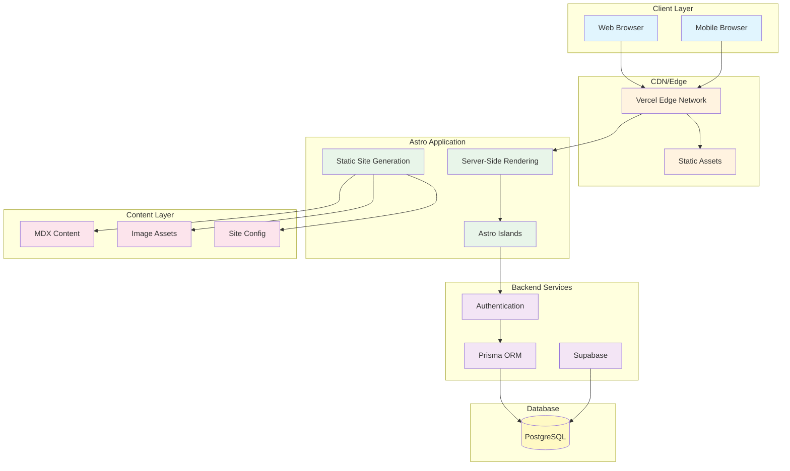

### 1.2 Simplified Architecture

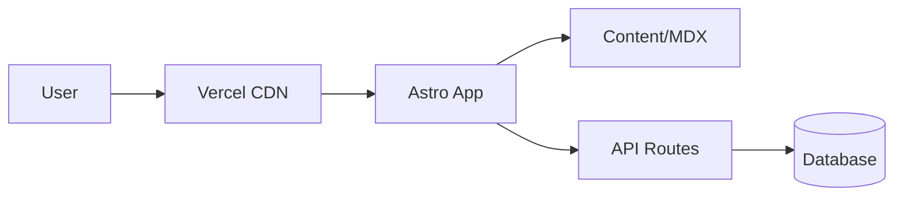

---

## 2. Mid-Level Component Architecture

### 2.1 Page Structure

```mermaid
flowchart TB
    subgraph "Pages"
        INDEX[/ - Home]
        BLOG[/blog - Blog List]
        POST[/blog/:slug - Post]
        ABOUT[/about - About]
        PROJECTS[/projects - Projects]
        TAGS[/tags - Tags]
    end

    subgraph "Layouts"
        BASE[BaseLayout]
        POST_LAYOUT[PostLayout]
        PAGE_LAYOUT[PageLayout]
    end

    subgraph "Components"
        HEADER[Header]
        FOOTER[Footer]
        NAV[Navigation]
        CARD[PostCard]
        TOC[TableOfContents]
        COMMENTS[Comments]
    end

    INDEX --> BASE
    BLOG --> BASE
    POST --> POST_LAYOUT
    ABOUT --> PAGE_LAYOUT
    PROJECTS --> PAGE_LAYOUT
    TAGS --> BASE

    BASE --> HEADER
    BASE --> FOOTER
    BASE --> NAV

    POST_LAYOUT --> TOC
    POST_LAYOUT --> COMMENTS
    POST_LAYOUT --> CARD
```

### 2.2 Content Structure

```mermaid
flowchart TB
    subgraph "Content Collections"
        POSTS[blog/]
        PROJECTS_C[projects/]
        PAGES[pages/]
    end

    subgraph "Content Schema"
        TITLE[title: string]
        DATE[date: Date]
        TAGS_S[tags: string[]]
        DRAFT[draft: boolean]
        IMAGE[image: ImageMetadata]
        DESC[description: string]
    end

    subgraph "Output"
        HTML[HTML Pages]
        RSS[RSS Feed]
        SITEMAP[Sitemap]
        OG[OG Images]
    end

    POSTS --> TITLE
    POSTS --> DATE
    POSTS --> TAGS_S
    POSTS --> DRAFT
    POSTS --> IMAGE
    POSTS --> DESC

    POSTS --> HTML
    POSTS --> RSS
    HTML --> SITEMAP
    HTML --> OG
```

### 2.3 Component Architecture

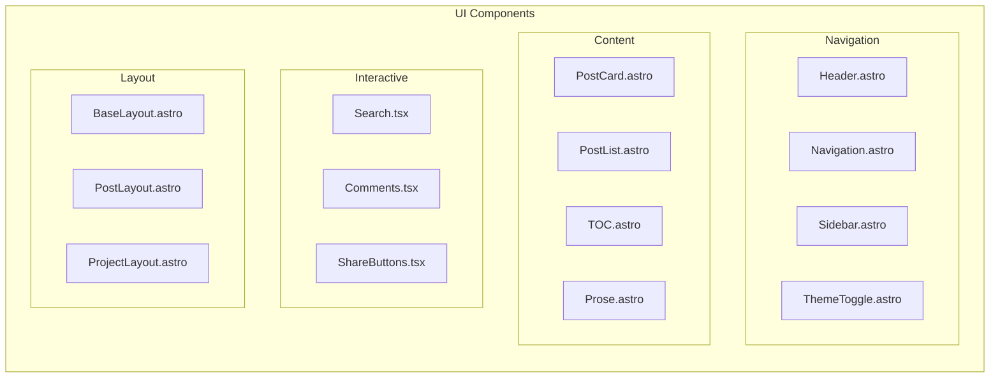

---

## 3. Low-Level Flow Diagrams

### 3.1 Page Request Flow

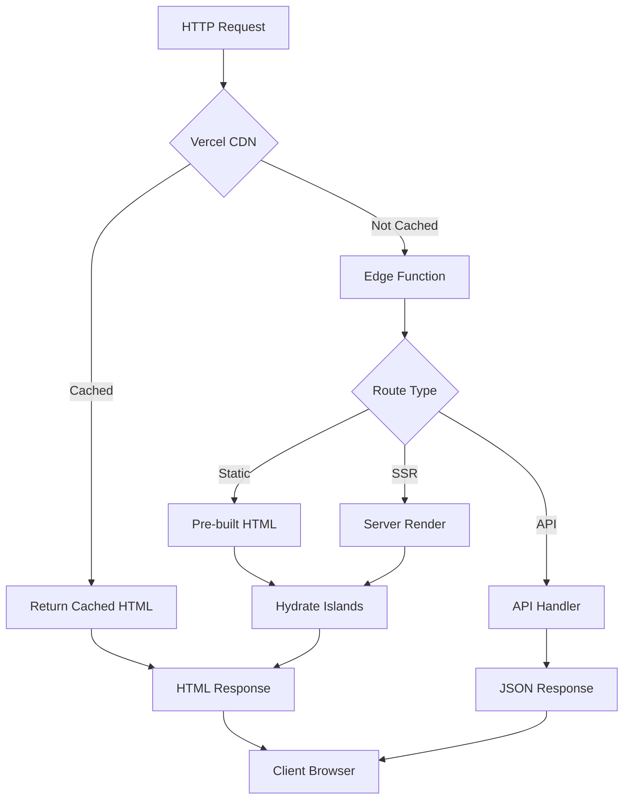

### 3.2 Blog Post Rendering Flow

```mermaid
flowchart TD
    SLUG[/blog/:slug] --> LOAD[Load MDX Content]
    LOAD --> PARSE[Parse Frontmatter]
    PARSE --> VALIDATE[Validate Schema]
    
    VALIDATE --> META[Extract Metadata]
    VALIDATE --> BODY[Process MDX Body]
    
    META --> TITLE[title]
    META --> DATE[date]
    META --> TAGS[tags]
    META --> IMAGE[featured image]
    
    BODY --> REMARK[Remark Plugins]
    REMARK --> REHYPE[Rehype Plugins]
    REHYPE --> KATEX[KaTeX Math]
    REHYPE --> SYNTAX[Syntax Highlighting]
    
    SYNTAX --> HTML[HTML Content]
    
    META --> LAYOUT[PostLayout]
    HTML --> LAYOUT
    
    LAYOUT --> TOC[Generate TOC]
    LAYOUT --> OG[Generate OG Image]
    LAYOUT --> RENDER[Render Page]
```

### 3.3 Authentication Flow

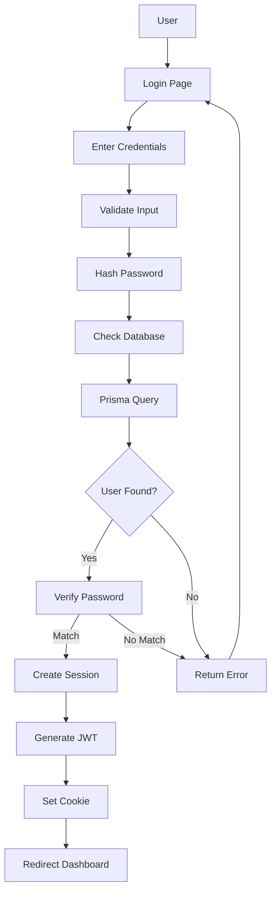

---

## 4. Data Lineage

### 4.1 Content Data Lineage

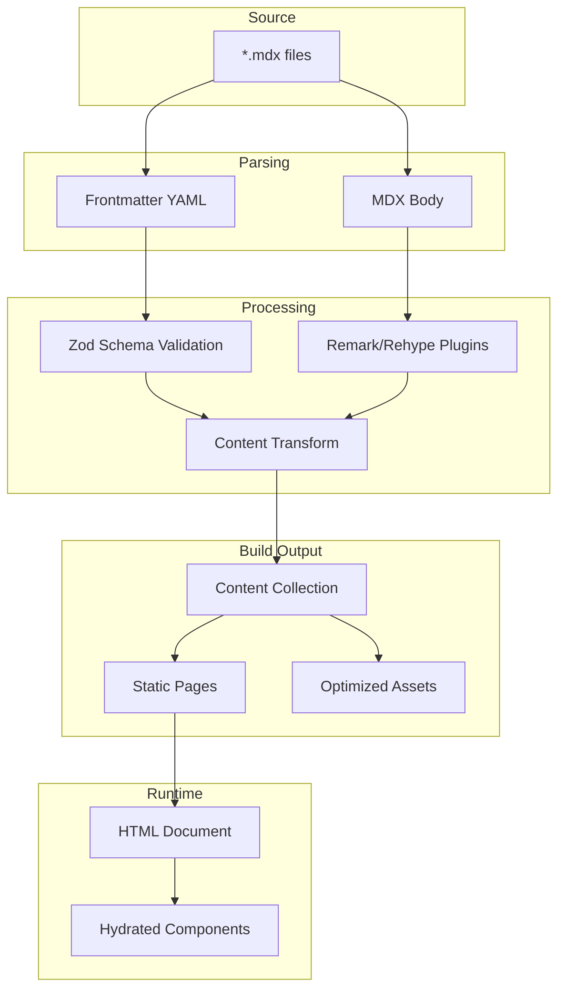

### 4.2 User Data Lineage

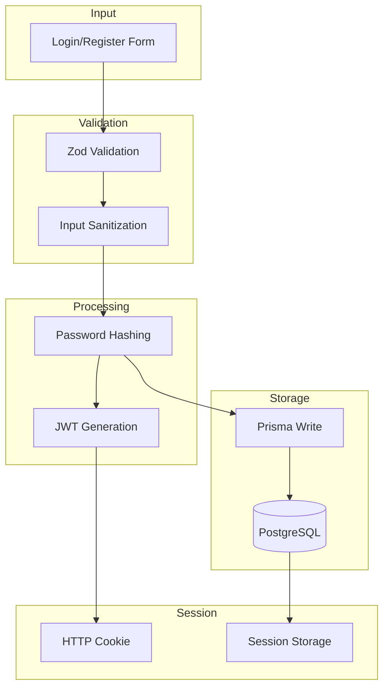

---

## 5. Class/Component Structure

### 5.1 Component Hierarchy

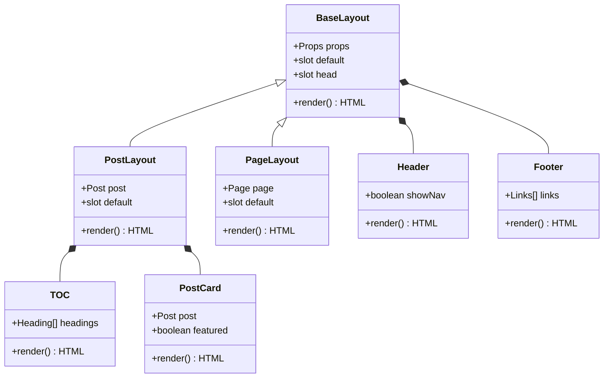

### 5.2 Database Schema

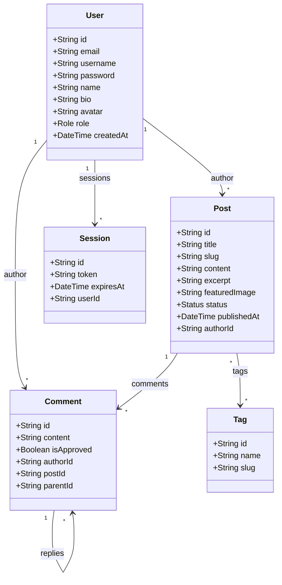

### 5.3 Service Classes

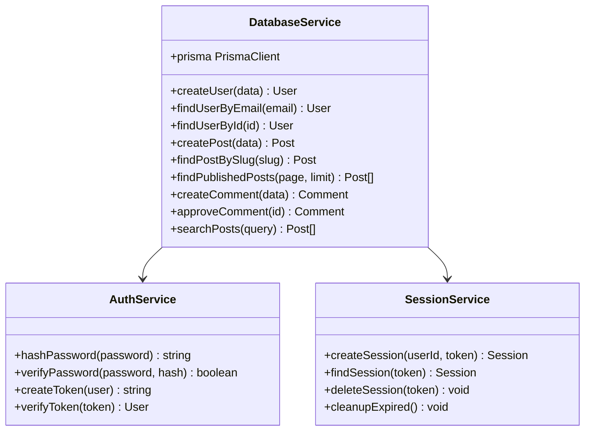

---

## 6. Sequence Diagrams

### 6.1 Page Load Sequence

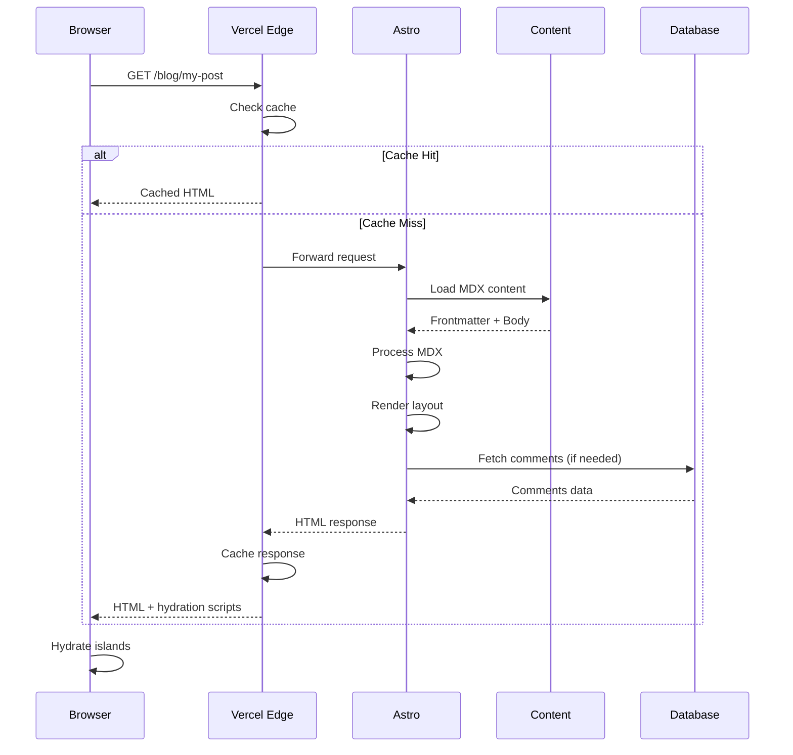

### 6.2 Comment Submission Sequence

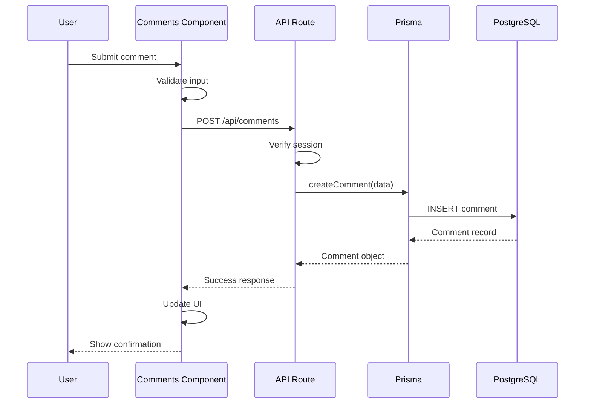

### 6.3 Search Flow Sequence

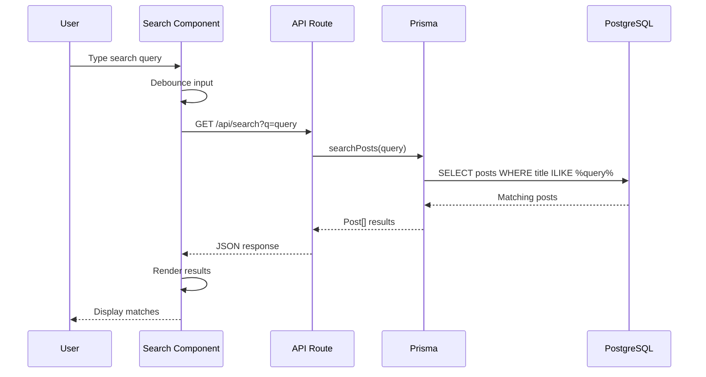

### 6.4 Build Process Sequence

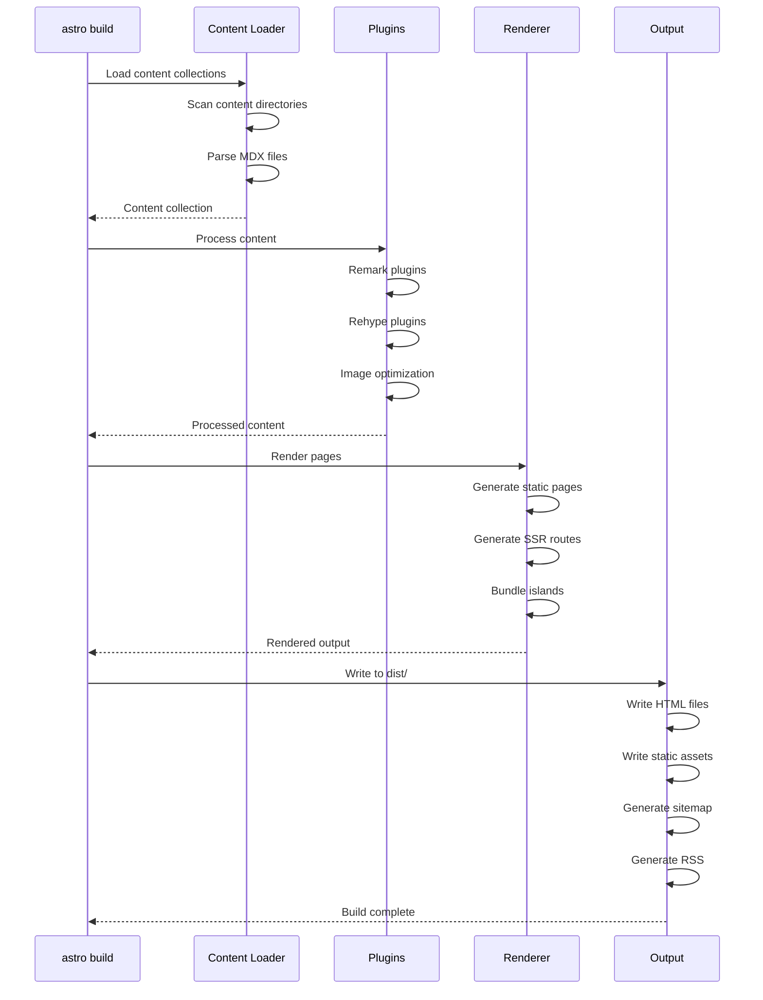

---

## 7. Unified System Map

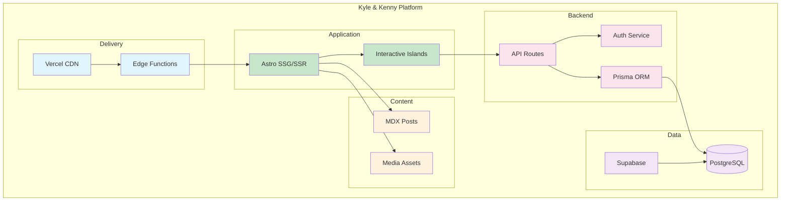

---

## Usage

View these diagrams in:
- GitHub/GitLab markdown preview
- VS Code with Mermaid extension
- [Mermaid Live Editor](https://mermaid.live/)
